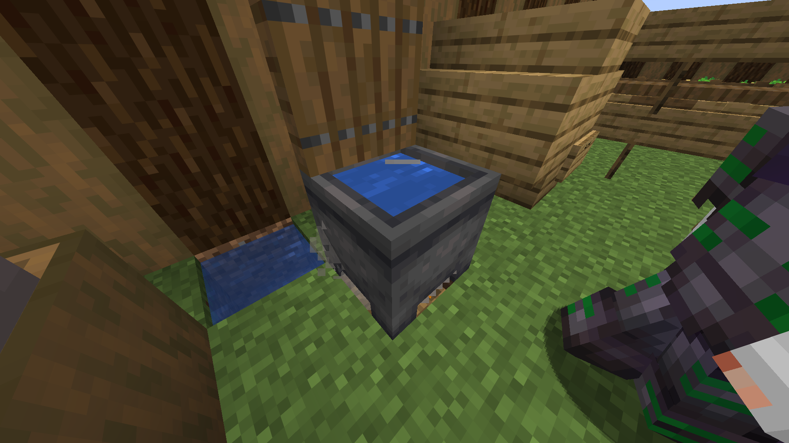
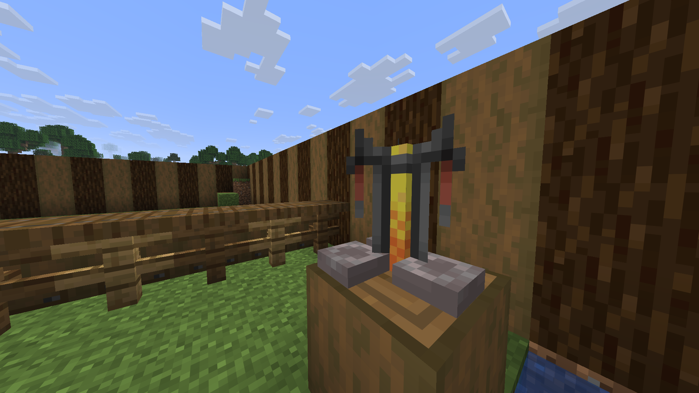
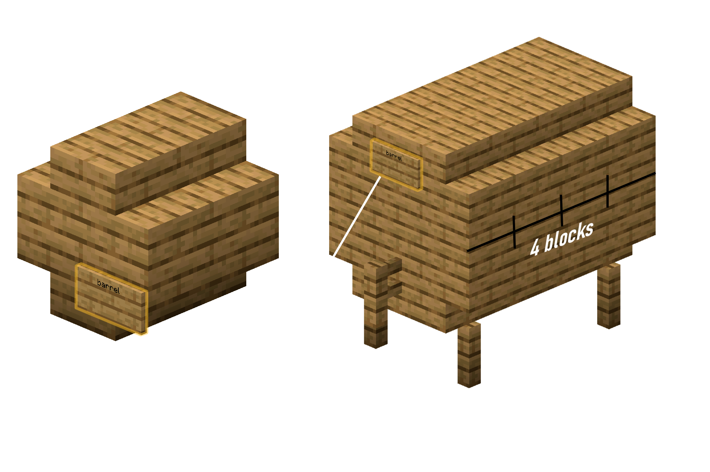

# 🍺 Полный Гайд по Пивоварению (BreweryX)

Добро пожаловать в искусство пивоварения! Этот гайд научит вас создавать алкогольные напитки в Minecraft с помощью плагина BreweryX.


---

## 📚 Содержание

1. [Что такое BreweryX?](#что-такое-breweryx)
2. [Основы пивоварения](#основы-пивоварения)
3. [Этапы приготовления](#этапы-приготовления)
4. [Качество напитков](#качество-напитков)
5. [Эффекты опьянения](#эффекты-опьянения)
6. [Советы и хитрости](#советы-и-хитрости)

---

## Что такое BreweryX?

**BreweryX** — это активно поддерживаемый форк легендарного плагина Brewery для Minecraft серверов. Плагин добавляет реалистичный процесс пивоварения с ферментацией, дистилляцией и выдержкой в бочках.

### Основные возможности:
- ✅ Варка алкогольных напитков с реальным эффектом опьянения
- ✅ Многоэтапный процесс: варка → дистилляция → выдержка
- ✅ Система качества напитков (от плохого до превосходного)
- ✅ Эффекты опьянения: шатание, искажение чата, эффекты зелий
- ✅ Создание собственных рецептов
- ✅ Точки пробуждения после пьянки


---

## Основы пивоварения

### Необходимое оборудование

#### 1. Котёл для варки


- Поставьте **котёл** над источником тепла
- Источники тепла: **огонь**, **лава**, **магма-блок**, **костёр**
- Наполните котёл водой

#### 2. Зельеварка для дистилляции


- Обычная **зельеварка** из Minecraft
- Используется для перегонки напитков
- Требует **огненный порошок** как топливо
- И всетовая пыль как перегонка

#### 3. Бочка для выдержки


Бочки строятся из деревянных досок и ступенек:

**Малая бочка (9 слотов):**
```
Слой 1: Ступеньки по углам
Слой 2: Доски по углам
```

**Большая бочка (27 слотов):**
```
Слой 1: 5x Ступеньки (крест)
Слой 2: 5x Доски (крест)
```

**Типы дерева:**
- 🌳 Любое (0)
- 🌲 Берёза (1)
- 🌳 Дуб (2)
- 🌴 Тропическое (3)
- 🌲 Ель (4)
- 🌳 Акация (5)
- 🌲 Тёмный дуб (6)
- 🍄 Багровое (7)
- 🍄 Искаженное (8)
- 🌳 Мангровое (9)
- 🌸 Вишнёвое (10)
- 🎋 Бамбуковое (11)

---

## Этапы приготовления

### Этап 1: Варка (Fermentation)

1. **Подготовьте котёл:**
   - Поставьте котёл над источником тепла
   - Наполните водой (ПКМ с ведром)

2. **Добавьте ингредиенты:**
   - ПКМ по котлу с ингредиентом в руке
   - Ингредиент исчезнет, появятся частицы зелья
   - Добавьте все необходимые ингредиенты

3. **Варите нужное время:**
   - ПКМ по котлу с **часами** — покажет время варки
   - Время варки указано в рецепте (в минутах)
   - Не переварите! Это испортит качество

4. **Соберите напиток:**
   - ПКМ по котлу с **пустыми бутылками**
   - Получите **сырой напиток** (ещё не готов!)

**💡 Совет:** Один котёл может вместить до 3 бутылок напитка.

---

### Этап 2: Дистилляция (Distillation)


Не все напитки требуют дистилляции (например, пиво не дистиллируют).

1. **Поместите в зельеварку:**
   - Положите сырой напиток в зельеварку
   - Добавьте **огненный порошок** как топливо

2. **Дистиллируйте нужное количество раз:**
   - Каждый цикл = 1 дистилляция
   - Время одного цикла указано в рецепте (обычно 20-80 сек)
   - Количество циклов указано в рецепте

3. **Получите дистиллят:**
   - После нужного количества циклов заберите напиток
   - Название изменится (например, "Дистиллят 2x")

**⚠️ Важно:** Не передистиллируйте! Лишние циклы испортят напиток.

---

### Этап 3: Выдержка (Aging)

Многие напитки требуют выдержки в бочках для улучшения качества.

1. **Постройте бочку:**
   - Используйте нужный тип дерева (указан в рецепте)
   - Постройте по схеме выше
   - ПКМ по табличке — откроется инвентарь бочки

2. **Поместите напиток в бочку:**
   - Положите бутылки в бочку
   - Закройте инвентарь

3. **Ждите нужное время:**
   - Время выдержки указано в рецепте (в "годах")
   - 1 год = 20 минут реального времени (по умолчанию)
   - Напиток будет стареть, даже если вы оффлайн

4. **Заберите готовый напиток:**
   - Откройте бочку и заберите напиток
   - Название изменится на финальное

**💡 Совет:** Можно проверить возраст напитка, посмотрев на его описание.

---

## Качество напитков


Качество напитка зависит от точности следования рецепту:

### ⭐ Плохое качество (1 звезда)
- Рецепт выполнен неточно
- Слабые эффекты
- Возможны негативные эффекты (тошнота, отравление)
- Название: "Плохой/Мутный/Прокисший..."

### ⭐⭐⭐ Среднее качество (3 звезды)
- Рецепт выполнен правильно
- Стандартные эффекты
- Название: обычное название напитка

### ⭐⭐⭐⭐⭐ Отличное качество (5 звёзд)
- Рецепт выполнен идеально
- Максимальные эффекты
- Минимум негативных эффектов
- Название: "Превосходный/Отборный/Благородный..."

### Факторы, влияющие на качество:

1. **Точность времени варки** (±10% допустимо)
2. **Правильное количество дистилляций**
3. **Достаточная выдержка в бочке**
4. **Правильный тип дерева бочки**
5. **Точное количество ингредиентов**

**💡 Совет:** Используйте часы для проверки времени варки!

---

## Эффекты опьянения


Когда вы пьёте алкогольные напитки, вы получаете эффект опьянения.

### Уровни опьянения:

#### 🟢 Лёгкое опьянение (1-30%)
- Небольшое покачивание камеры
- Редкие опечатки в чате
- Лёгкие эффекты зелий

#### 🟡 Среднее опьянение (31-60%)
- Заметное шатание
- Частые опечатки в чате
- Средние эффекты зелий
- Возможна тошнота

#### 🟠 Сильное опьянение (61-90%)
- Сильное шатание
- Сильное искажение чата
- Сильные эффекты зелий
- Тошнота и слабость

#### 🔴 Критическое опьянение (91-100%)
- Экстремальное шатание
- Почти нечитаемый чат
- Возможна потеря сознания
- Вы можете "проснуться" в случайном месте

### Искажение чата:

При опьянении ваши сообщения в чате искажаются:
- `привет` → `прривеет`
- `как дела` → `кааг деелаа`
- `пошли играть` → `пошшлии игратьь`

### Отрезвление:

- ⏰ Время: опьянение проходит со временем
- ☕ Кофе: снижает уровень опьянения
- 🥛 Молоко: убирает эффекты зелий, но не опьянение
- 🍞 Еда: немного ускоряет отрезвление

---

## Советы и хитрости

### 🎯 Для начинающих:

1. **Начните с простых рецептов:**
   - Пшеничное пиво (сложность 1)
   - Квас (сложность 2)
   - Картофельный суп (сложность 1)

2. **Используйте часы:**
   - ПКМ по котлу с часами показывает время варки
   - Это поможет не переварить напиток

3. **Записывайте рецепты:**
   - Создайте книгу с рецептами
   - Записывайте точное время и ингредиенты

### 🏆 Для опытных:

1. **Массовое производство:**
   - Стройте несколько котлов рядом
   - Используйте большие бочки (27 слотов)
   - Синхронизируйте время варки

2. **Оптимизация качества:**
   - Используйте таймеры для точного времени
   - Проверяйте каждый этап
   - Не спешите — лучше подождать

3. **Секретные рецепты:**
   - Экспериментируйте с ингредиентами
   - Некоторые рецепты могут быть скрыты
   - Делитесь находками с друзьями

### 💰 Бизнес-идеи:

1. **Таверна:**
   - Постройте бар или таверну
   - Продавайте напитки игрокам
   - Устраивайте вечеринки

2. **Пивоварня:**
   - Создайте производство
   - Специализируйтесь на определённых напитках
   - Поставляйте оптом

3. **Коллекционирование:**
   - Собирайте все виды напитков
   - Создавайте музей напитков
   - Ищите редкие рецепты

---

## 🎮 Полезные команды

```
/brew help - Помощь по командам
/brew info - Информация о вашем опьянении
/brew info <игрок> - Информация об опьянении игрока
/brew create <название> - Создать напиток командой (админ)
```

---

## 📖 Навигация по книге рецептов

- [🍺 Пиво](01_пиво.md) - Лёгкие напитки для начинающих
- [🍷 Вино](02_вино.md) - Изысканные вина
- [🥃 Крепкие напитки](03_крепкие_напитки.md) - Виски, водка, ром и другие
- [🍹 Ликёры](04_ликёры.md) - Сладкие и ароматные напитки
- [☕ Безалкогольные напитки](05_безалкогольные.md) - Кофе, квас, супы

---

## 🔗 Полезные ссылки

- [Официальная документация BreweryX](https://brewery.lumamc.net)
- [GitHub BreweryX](https://github.com/BreweryTeam/BreweryX)
- [Discord сервер](https://discord.gg/breweryx)

---

*Приятного пивоварения! 🍻*


