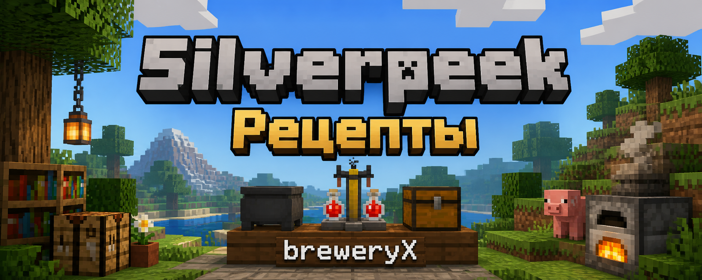

# 🍺 Книга Рецептов Напитков SilverPeek

> Полное руководство по приготовлению алкогольных и безалкогольных напитков на сервере **SilverPeek**


---

---

## 📖 О проекте

Эта книга содержит **более 40 рецептов** напитков для сервера **SilverPeek** с плагином BreweryX, включая:
- 🍺 Пиво (пшеничное, тёмное, тыквенное)
- 🍷 Вино (красное, вишнёвое, шампанское, глинтвейн)
- 🥃 Крепкие напитки (виски, водка, ром, текила, абсент, коньяк)
- 🍹 Ликёры (медовуха, сидр, кальвадос)
- ☕ Безалкогольные напитки (кофе, квас, горячий шоколад)

Каждый рецепт включает:
- ✅ Подробные ингредиенты
- ✅ Пошаговый процесс приготовления
- ✅ Информацию о качестве и эффектах
- ✅ Уровень сложности
- ✅ Советы по приготовлению

---

## 🚀 Быстрый старт

### Для игроков:

1. **Прочитайте гайд:**
   - [📚 Полный гайд по пивоварению](00_гайд_по_пивоварению.md)

2. **Выберите категорию:**
   - [🍺 Пиво](01_пиво.md)
   - [🍷 Вино](02_вино.md)
   - [🥃 Крепкие напитки](03_крепкие_напитки.md)
   - [🍹 Ликёры](04_ликёры.md)
   - [☕ Безалкогольные напитки](05_безалкогольные.md)

3. **Начните варить!**

---

## 📚 Содержание книги

### [📖 Гайд по пивоварению](00_гайд_по_пивоварению.md)
Полное руководство для начинающих и опытных пивоваров:
- Что такое BreweryX?
- Необходимое оборудование
- Этапы приготовления (варка, дистилляция, выдержка)
- Система качества напитков
- Эффекты опьянения
- Советы и хитрости

### [🍺 Пиво](01_пиво.md)
Лёгкие напитки для начинающих:
- Пшеничное пиво (5%)
- Классическое пиво (6%)
- Тёмное пиво (7%)
- Тыквенное пиво (6%)

### [🍷 Вино](02_вино.md)
Изысканные вина с богатым букетом:
- Красное вино (8%)
- Вишнёвое вино (9%)
- Одуванчиковое вино (7%)
- Глинтвейн (8%)
- Шампанское (10%) ✨

### [🥃 Крепкие напитки](03_крепкие_напитки.md)
Высокоградусные напитки для опытных:
- Виски (26%)
- Огненный виски (28%) 🔥
- Водка (20%)
- Золотая водка (20%) ✨
- Грибная водка (18%) 👁️
- Арбузная водка (18%)
- Ром (30%)
- Грог (16%)
- Джин (20%)
- Текила (20%)
- Кактусовая текила (22%)
- Абсент (42%)
- Зелёный абсент (46%) 💀
- Самогон (35%)
- Саке (16%)
- Коньяк (24%) ✨

### [🍹 Ликёры](04_ликёры.md)
Сладкие и ароматные напитки:
- Медовуха (9%)
- Яблочная медовуха (11%)
- Медовый ликёр (15%) ✨
- Яблочный сидр (7%)
- Яблочный ликёр / Кальвадос (14%)
- Эгг-ног / Адвокат (10%)

### [☕ Безалкогольные напитки](05_безалкогольные.md)
Напитки без алкоголя:
- Кофе (-6% отрезвляет) ⚡
- Холодный кофе (-8% отрезвляет) 🧊
- Горячий шоколад (0%) 🍫
- Картофельный суп (0%) 🍲
- Квас (2%)
- Свекольный квас (3%)

---

## 🎯 Уровни сложности

Рецепты разделены по уровням сложности:

- ⭐ **Лёгкие (1-2)** - Для начинающих, простые рецепты
- ⭐⭐⭐ **Средние (3-5)** - Требуют внимания к деталям
- ⭐⭐⭐⭐⭐ **Сложные (6-8)** - Для опытных пивоваров
- ⭐⭐⭐⭐⭐⭐⭐⭐⭐ **Экспертные (9+)** - Мастерский уровень

---

## 🛠️ Необходимое оборудование

### Для варки:
- 🔥 Котёл над источником тепла (огонь, лава, магма-блок, костёр)
- 🕐 Часы (для проверки времени варки)
- 🍶 Стеклянные бутылки

### Для дистилляции:
- ⚗️ Зельеварка
- 🔥 Огненный порошок (топливо)

### Для выдержки:
- 🛢️ Деревянные бочки (малые или большие)
- 🪵 Доски и ступеньки нужного типа дерева
- 🪧 Табличка

---

## 📊 Статистика

- **Всего рецептов:** 40+
- **Категорий:** 5
- **Уровней сложности:** 9
- **Типов дерева для бочек:** 12
- **Максимальная крепость:** 46% (Зелёный абсент)
- **Самая долгая выдержка:** 25 лет (Коньяк XO)

---

## 🤝 Вклад в проект

Хотите добавить свои рецепты или улучшить существующие?

1. Форкните репозиторий
2. Создайте ветку для ваших изменений
3. Добавьте рецепты в `recipes.yml`
4. Обновите соответствующие `.md` файлы
5. Создайте Pull Request

### Формат рецепта:

```yaml
recipe_id:
  name: Плохое/Среднее/Отличное название
  ingredients:
    - INGREDIENT/количество
  cookingtime: минуты
  distillruns: количество
  distilltime: секунды
  wood: тип_дерева
  age: годы
  color: цвет
  difficulty: 1-10
  alcohol: процент
  lore:
    - Описание
  effects:
    - EFFECT/уровень/длительность
```

---

